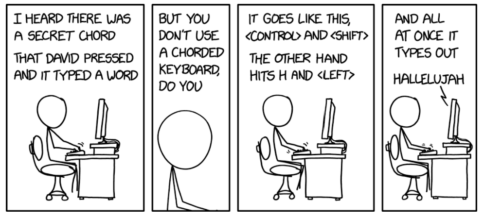

# hallelujah-xkcd

A tiny script to produce the chord described in https://xkcd.com/2583/, "Chorded Keyboard".

## Dependencies

This is an AutoHotKey script. AHK is downloadable [here](https://www.autohotkey.com/).

## Run the script

Once you've installed AHK, right-click on the script and select "Run Script". Then you can press Ctrl+Shift+Left arrow, then press the 'h' key, and "hallelujah" will be typed in whatever window you have selected! You may also choose to be quietly amused by this.

## Notes

- One known limitation of AHK is that it doesn't support 4-key hotkeys, at least not readily. The effect of that here is that you have to press 'h' last, whereas the other 3 keys can be pressed in any order.

- The timeout to press the 'h' key is one second after the other 3 keys are held down. You can change this by updating the value after the 'T' in the script to the value in seconds you'd prefer (fractional values are ok).
